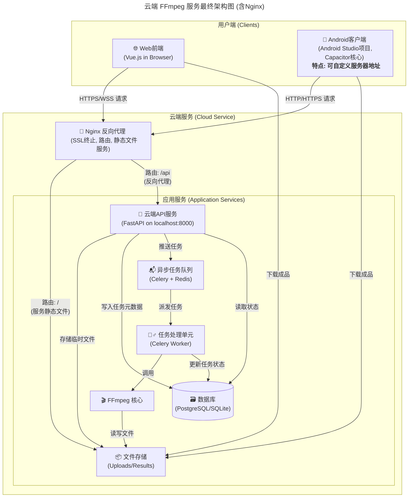

# 云端 FFmpeg 服务架构详解

## 一、 核心设计思想

本项目的系统架构基于现代 Web 应用中成熟的 **前后端分离** 和 **异步任务处理** 模式。其核心思想是将用户交互的 **表现层 (Frontend)** 与负责业务逻辑和计算的 **服务层 (Backend)** 完全解耦，并通过异步任务队列来处理耗时操作，从而确保系统的 **高响应性、高可用性和可扩展性**。

整体上，这是一个典型的 **C/S (客户端/服务器)** 架构，但通过统一的云端账户体系，支持 **多客户端 (Web + Android)** 共享数据和服务。最终的生产环境部署引入了 **Nginx 作为反向代理**，进一步提升了系统的健壮性和安全性。

## 二、 系统架构图

## 三、 组件详解

### 1. 用户端 (Clients)

- **🌐 Web 前端 (WebApp)**:

  - **技术栈**: Vue 3, Vite, TypeScript, Pinia。
  - **职责**: 系统的 Web 用户界面。在生产环境中，它被配置为将所有 API 请求发送到相对路径 `/api`，由 Nginx 进行代理。

- **📱 Android 客户端 (AndroidApp)**:
  - **技术栈**: 这是一个 **Android Studio 项目**，其核心 Web 视图（WebView）由 **Capacitor** 驱动，加载与 WebApp 相同的 Vue.js 代码。
  - **职责**: 提供原生 App 体验。通过在 Android Studio 中进行原生代码开发，实现了以下增强功能：
    - **自定义服务器地址**：在 App 的设置界面中，允许用户修改 API 服务器的 URL。这使得 App 可以连接到任何用户私有部署的后端服务，极大地提高了灵活性。
    - **原生功能集成**：通过 Capacitor 插件和原生代码，实现了系统分享、后台任务、原生通知等功能。

### 2. 云端服务 (Cloud Service)

- **🚦 Nginx 反向代理**:

  - **职责**: 作为整个云端服务的**唯一入口**，是系统的“看门人”。它监听 80/443 端口，负责：
    - **SSL 终止**: 处理 HTTPS 加密/解密，确保传输安全。
    - **静态文件服务**: 当用户请求根路径 (`/`) 或其他非 API 路径时，直接高效地返回 Vue.js 前端的静态文件（HTML, JS, CSS）。
    - **反向代理**: 当请求路径匹配 `/api` 时，将请求**无缝转发**给在内网运行的 FastAPI 应用。这个过程对客户端透明，完美解决了生产环境的**跨域问题**。
    - **负载均衡** (可选): 未来可以将请求分发到多个 FastAPI 应用实例，实现水平扩展。

- **🚀 云端 API 服务 (APIServer)**:

  - **技术栈**: Python, FastAPI。
  - **职责**: 在部署环境中，它不再直接暴露于公网，而是运行在本地端口（如`localhost:8000`），只接收来自 Nginx 的请求。其核心职责（用户认证、任务分派等）不变。

- **📬 异步任务队列 (TaskQueue)**, **👷‍♂️ 任务处理单元 (Worker)**, **🗃️ 数据库 (Database)**, **📦 文件存储 (FileStorage)**, **🎬 FFmpeg 核心**:
  - 这些内部组件的职责与中期设计一致，共同构成了后台的核心处理能力。

## 四、 核心工作流程详解 (含 Nginx)

1.  **用户访问**:

    - **Web 用户**: 在浏览器输入 `https://your-domain.com`。请求到达 Nginx，Nginx 返回前端静态页面。
    - **App 用户**: 打开 App，App 根据设置中的服务器地址（默认为 `https://your-domain.com`）向 Nginx 发起请求。

2.  **任务创建**:

    - 前端应用（Web/App）向 `/api/tasks` 发起上传和创建任务的请求。
    - 请求首先到达 Nginx。Nginx 识别出 `/api` 路径，遂将请求转发给内网的 FastAPI 服务。
    - FastAPI 服务执行其标准逻辑：保存文件、在数据库创建任务、将任务推送到 Celery 队列。

3.  **异步处理**:

    - 此流程完全在云端服务内部进行，与中期设计相同。Worker 从队列获取任务，调用 FFmpeg 处理，并更新数据库。

4.  **获取结果**:
    - 前端应用向 `/api/tasks/{task_id}` 轮询状态。
    - 请求同样经由 Nginx 代理到 FastAPI。FastAPI 从数据库查询状态并返回。
    - 任务成功后，API 返回结果文件的下载路径（如 `/results/output.mp4`）。用户点击下载链接，该请求再次由 Nginx 处理，Nginx 直接从`FileStorage`中返回对应的静态文件给用户。

## 五、 架构优势 (最终版)

- **安全与统一**: Nginx 作为单一入口，简化了安全策略（如 SSL 证书、防火墙规则）的管理，并为用户提供了统一的访问域名。
- **高性能**: Nginx 处理静态文件的性能远高于应用服务器，分离了动静态请求，提升了 Web 应用的加载速度。
- **部署解耦**: 前后端应用可以独立部署和更新。只要 API 约定不变，任一方的升级都不会影响另一方。
- **高灵活性 (Android)**: 通过原生代码实现的自定义服务器功能，使得 Android 客户端可以脱离官方服务器，适应更广泛的私有化部署场景。
